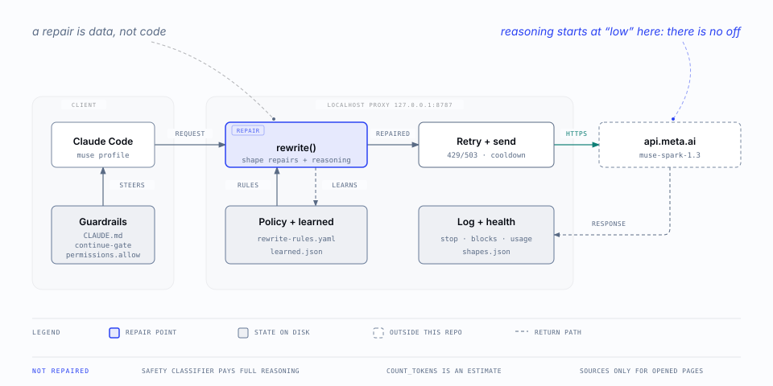

# claude-muse

Claude Code's interface, running Meta's `muse-spark-1.3` instead of an Anthropic model.

You keep the client you already know - the keyboard, the permission model, the skills, the subagents, the worktrees - and swap only the model behind it. Useful for comparing the two models on identical work, and for spending a Muse Code subscription without learning a second agent's UI.

Your existing `claude` is untouched. `claude-muse` is a separate launcher with its own config profile, so nothing here can change how your normal sessions behave.

## Where this is

**It works, and it holds a long task.** Web search, subagents, file edits, streaming and the context readout all behave; the proxy repairs the shapes the endpoint rejects, learns the ones nobody anticipated, rides out rate limits, and answers `count_tokens` itself. Every response now logs why it stopped and what it contained, so a claim about the model's behavior is a number you can grep for rather than an impression.

**What still costs you something is the safety classifier.** It is a little over half of all requests, it carries no reasoning directive, and this endpoint has no setting for "do not reason" - its cheapest tier is `low`. So the classifier pays full reasoning on every mechanical yes/no question, and when it runs past Claude Code's patience the tool call is denied rather than judged. Allowing the tools you trust is the supported answer, and the profile ships with the edit tools already on that list.

Three things are deliberately not repaired: the classifier above, `count_tokens` (answered from a calibrated estimate, never a tokenizer fact), and web-search sources (reconstructed only for pages the model actually opened). Each is labeled where it appears rather than quietly smoothed over.



That figure is the first of five: [the architecture gallery](docs/architecture.md) walks from system context down to the retry policy.

## Why a proxy is involved

The Meta Model API serves an **Anthropic-compatible surface** at `https://api.meta.ai/v1/messages` - same request shape, same `anthropic-version` header, same response envelope. Compatible, but a *subset*, and Claude Code routinely sends fields that subset rejects.

The failures are not the kind you can read. A rejected `max_uses` takes out web search. A rejected `safeguards` takes out the auto-mode classifier, which surfaces as `muse-spark-1.3 is temporarily unavailable, so auto mode cannot determine the safety of Agent` - so every subagent launch fails, and the error blames the model. A classifier-sized `max_tokens` returns `200` with empty content, because Spark spends the whole budget thinking before it emits anything.

`proxy.py` (a thin entry over `engine/`) repairs those shapes on the way through and passes everything else byte for byte. It never reads the credential. When it meets a rejection it has no rule for, it reads the field name out of the 400, records it, strips it and retries - so a new gap costs one slow request instead of a debugging session. [`docs/api-subset.md`](docs/api-subset.md) has every measured row.

## Install

Requires macOS, Claude Code, `jq`, and Meta's `muse` CLI already logged in (`muse login`).

```bash
git clone https://github.com/vasyl-stanislavchuk/claude-muse.git ~/projects/claude-muse
cd ~/projects/claude-muse
./install.sh --check          # verify the environment first
./install.sh
echo 'source ~/projects/claude-muse/templates/shell-function.zsh' >> ~/.zshrc
exec zsh
claude-muse
```

`install.sh` is idempotent, and after the first run you rarely invoke it by hand: it points git at `.githooks/`, so a commit, a pull or a branch switch re-links the install for you. By default it symlinks the engine into `~/.config/claude-muse`, so editing the repo *is* editing the install and preflight notices on the next launch. `--copy` freezes copies instead. It never overwrites an existing `settings.json`, and anything it does replace is backed up under `~/.config/claude-muse/.backups/`.

`./uninstall.sh` removes the agent and the engine; `--purge` also removes the state. Neither touches your session history.

## What gets installed where

| Path | What it is |
| --- | --- |
| `~/.config/claude-muse/` | the engine, symlinked from this repo, plus runtime state |
| `~/.config/claude-muse/claude-muse` | the launcher: the shell function forwards to it, and other tools run it in place of `claude` |
| `~/.config/claude-muse/learned.json` | fields the proxy taught itself to drop, added as it meets them |
| `~/.config/claude-muse/rewrite-rules.yaml` | the repair policy: which shapes the proxy rewrites, editable without touching code |
| `~/.config/claude-muse/shapes.json` | every distinct request shape Claude Code has sent, recorded once each |
| `~/.config/claude-muse/proxy.log` | every rewrite and every upstream error. First place to look. Rotates at 1 MiB |
| `~/.config/claude-muse/proxy.err` | empty unless the proxy crashed. A byte in here is a finding |
| `~/.claude-profiles/muse/` | the Claude Code profile: settings, sessions, history |
| `~/.claude-profiles/muse/CLAUDE.md` | how the model should behave in a muse session, symlinked from this repo |
| `~/.claude-profiles/muse/hooks/continue-gate` | a `Stop` hook that blocks a turn ending by asking permission to continue |
| `~/.claude-profiles/muse/skills/review-learned` | the learned-state review skill, symlinked from this repo; run it with `/review-learned` |
| `~/Library/LaunchAgents/co.medallion.claude-muse-proxy.plist` | keeps the proxy up across reboots |

Runtime state stays out of the repo. The one thing worth knowing about the profile: it has **no `model` key on purpose**, because a settings-file model pin outranks `ANTHROPIC_MODEL` and would quietly send every request to Anthropic on a Meta key.

## Verify

```bash
python3 -m pytest tests/ -q                            # offline: every rewrite rule, no tokens spent
~/.config/claude-muse/api-key.sh | wc -c                # a key, not an error
curl -s 127.0.0.1:8787/__health | jq                    # version, pid, learned fields
~/.config/claude-muse/probe.sh http://127.0.0.1:8787    # every shape ok
claude-muse -p "Reply with exactly: ok"                 # ok
```

`probe.sh https://api.meta.ai` runs the same shapes against the raw endpoint, which is how you see what the proxy is repairing. `bin/run-prompts.sh` replays a directory of prompts through the model non-interactively, for comparing the two models on identical work - note that it sends prompt bodies to `api.meta.ai`, so settle retention terms before pointing it at a real corpus. Then, in a session, search the web for something current and launch an `Explore` subagent - both used to fail and both are the point of the proxy.

## Docs

- [`docs/api-subset.md`](docs/api-subset.md) - what the endpoint implements, what it rejects, and what breaks when it does. Includes the troubleshooting table.
- [`docs/design.md`](docs/design.md) - why the logic is not in the shell function, how auto mode degrades, what the context readout can and cannot tell you.
- [`docs/auth.md`](docs/auth.md) - how the subscription key is resolved, and why a console key will not work.
- [`docs/promotion.md`](docs/promotion.md) - when learned state earns a review, and what each verdict costs.
- [`docs/launching.md`](docs/launching.md) - starting Muse sessions from scripts and other tools, including medallion's md CLI and Switchboard.

## Scope

This is internal tooling, not a supported product. It tracks two moving targets - Claude Code releases and the endpoint's subset - and the learn-and-retry mechanism exists precisely because the second one is not documented anywhere.

Nothing here is Meta-specific except `bin/api-key.sh`, the model ids in `lib/model-env.sh`, and the defaults at the top of `engine/server.py`. Pointing it at a different Anthropic-compatible endpoint is a matter of changing those.
