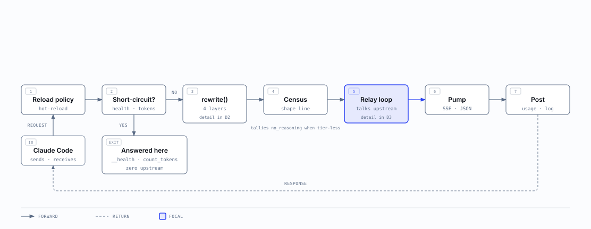
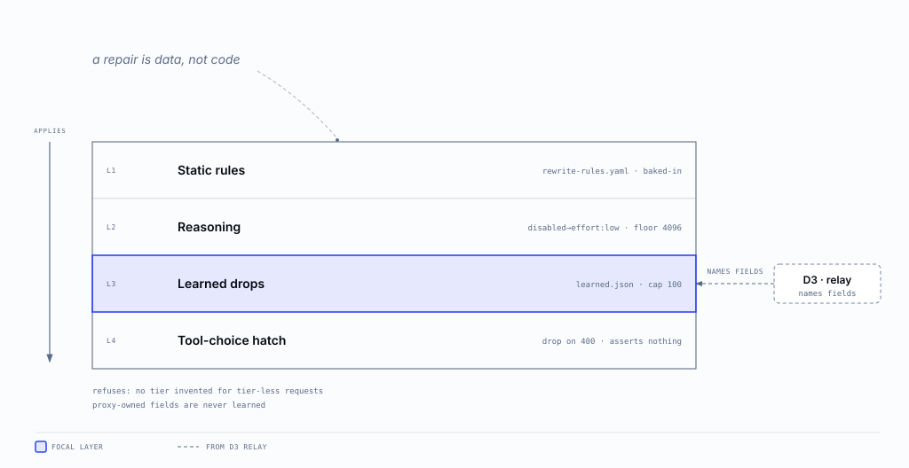
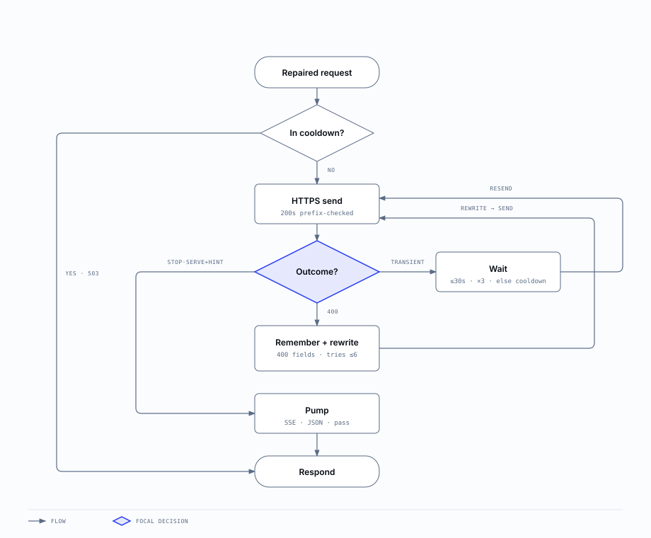
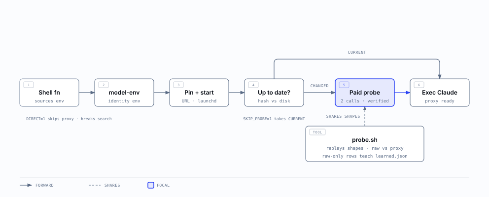

# Architecture

Five diagrams, wide to narrow. Start at the top if you are new here; drop to the level that matches the question you are asking. Every figure states one claim, and every number on every figure matches the code it draws.

- [D0 · System context](#d0)
- [D1 · Request lifecycle](#d1)
- [D2 · Repair internals](#d2)
- [D3 · Relay and retry](#d3)
- [D4 · Launch and probe](#d4)

## D0 · System context

One localhost hop repairs, retries, and records every request; responses return to Claude Code. Runtime state lives under [~/.config/claude-muse/](auth.md), outside this repo.

## D1 · Request lifecycle

Every request passes seven numbered stages; local paths answer without touching the network and only the relay loop talks upstream. Read this before you touch [the engine](design.md).

## D2 · Repair internals

Repairs apply in four layers, data before code; the retry loop teaches layer three. The measured rules behind each layer are in [the API subset](api-subset.md).

## D3 · Relay and retry

Three failure classes, three treatments: wait and resend, learn and resend, or stop with a hint. Match each path to its log line when you debug a slow or failed request.

## D4 · Launch and probe

A normal launch costs nothing; the first launch after an edit spends two calls proving it works. The launch rules behind this lane are in [the design notes](design.md).

